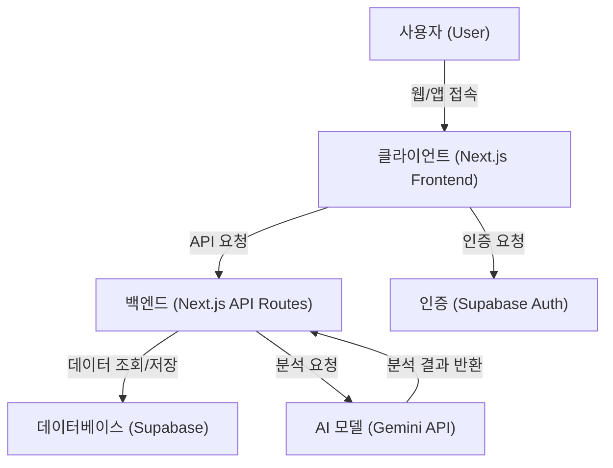
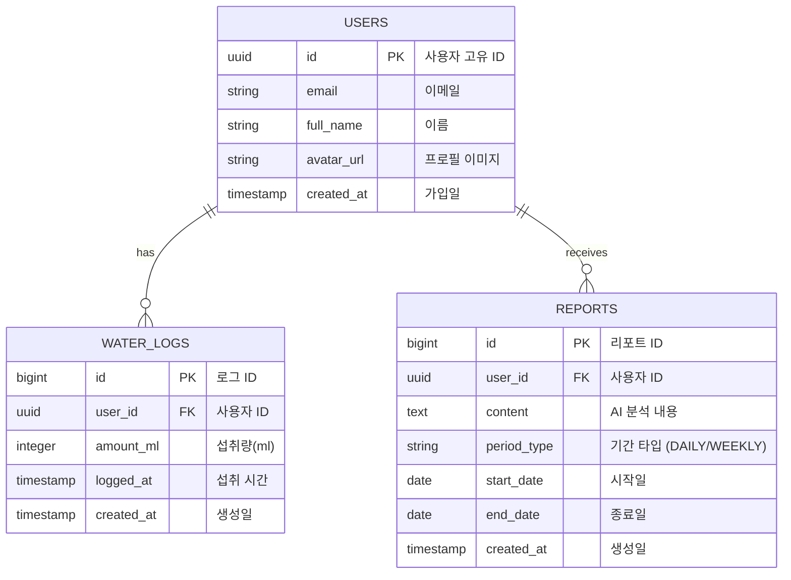
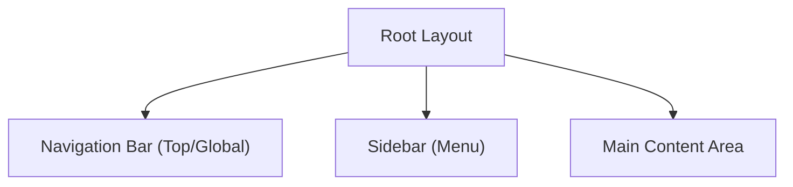

# 소프트웨어 디자인 및 아키텍처 (Software Design & Architecture)

이 문서는 `user_stories.md`를 기반으로 한 물 마시기 습관 형성 서비스의 기술적 설계 문서입니다.

## 1. 기술 스택 (Tech Stack)

| 구분 | 기술 | 설명 |
| --- | --- | --- |
| **Frontend** | **Next.js (App Router)** | React 프레임워크, 서버 사이드 렌더링 및 정적 생성 지원 |
| **Styling** | **Tailwind CSS** | 유틸리티 퍼스트 CSS 프레임워크 (반응형 디자인 용이) |
| **Language** | **TypeScript** | 정적 타입 시스템을 통한 안정성 확보 |
| **Backend** | **Next.js API Routes** | 별도 백엔드 서버 없이 Next.js 내장 API 기능 활용 |
| **Database** | **Supabase (PostgreSQL)** | 관계형 데이터베이스 및 실시간 구독 기능 |
| **Auth** | **Supabase Auth** | 이메일/비밀번호 및 소셜 로그인(Google) 지원 |
| **AI** | **Google Gemini API** | 물 섭취 패턴 분석 및 리포트 생성 LLM |
| **Deployment** | **Vercel** | Next.js 최적화 배포 플랫폼 |

---

## 2. 시스템 아키텍처 (System Architecture)

---

## 3. 데이터베이스 설계 (Database Design)

### 3.1 ERD (Entity Relationship Diagram)

---

## 4. 프론트엔드 설계 (Frontend Design)

### 4.1 UI/UX 컨셉
- **구글 캘린더 스타일**: 시간대별 물 섭취 기록을 캘린더 뷰(일간/주간)로 시각화
    - 세로축: 시간 (00:00 ~ 24:00)
    - 이벤트 블록: 물 섭취 기록 (클릭 시 상세 정보 표출)
- **반응형 디자인**:
    - **Desktop**: 사이드바 메뉴 + 넓은 캘린더 뷰
    - **Mobile**: 하단 탭 바(혹은 햄버거 메뉴) + 일간 뷰 중심의 컴팩트한 레이아웃

### 4.2 레이아웃 구조 (Layout Structure)

#### 컴포넌트 상세
1.  **Navigation Bar**:
    - 로고 (좌측)
    - 현재 날짜/뷰 컨트롤러 (중앙)
    - 사용자 프로필/로그아웃 버튼 (우측)
2.  **Sidebar**:
    - 메뉴: 홈 (대시보드), 리포트, 설정
    - 빠른 기록 추가 버튼 ('+' FAB 형태)
3.  **Main Content**:
    - **Calendar View**: 시간 흐름에 따른 물 섭취 로그 시각화
    - **Metrics**: 당일 총 섭취량, 목표 달성률 게이지

---

## 5. 백엔드 설계 (Backend Design)

### 5.1 API 엔드포인트

| Method | Endpoint | 설명 |
| --- | --- | --- |
| **GET** | `/api/logs` | 특정 기간의 물 섭취 기록 조회 |
| **POST** | `/api/logs` | 새로운 물 섭취 기록 추가 |
| **DELETE** | `/api/logs/:id` | 기록 삭제 |
| **POST** | `/api/reports/generate` | AI 리포트 생성 요청 (Gemini API 호출) |
| **GET** | `/api/reports` | 생성된 리포트 목록 조회 |

### 5.2 AI 리포트 생성 로직
1.  사용자의 최근 물 섭취 로그 데이터를 DB에서 조회
2.  데이터를 포맷팅하여 Gemini API 프롬프트 구성
3.  Gemini API 호출 (패턴 분석, 건강 조언 요청)
4.  응답 결과를 `REPORTS` 테이블에 저장 및 클라이언트에 반환
